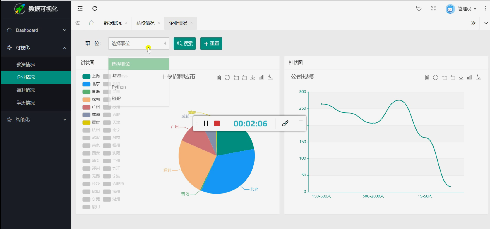
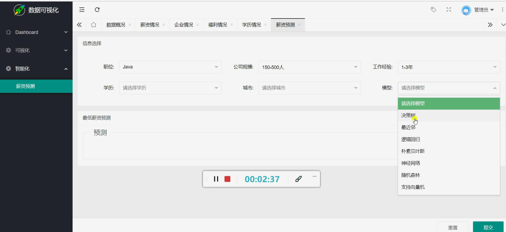
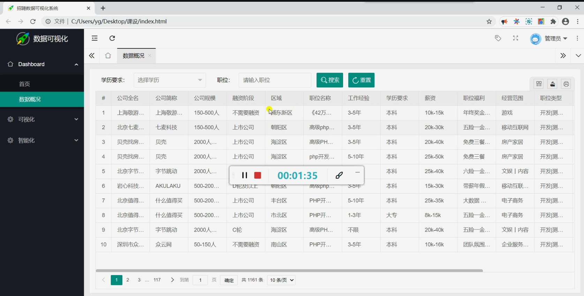
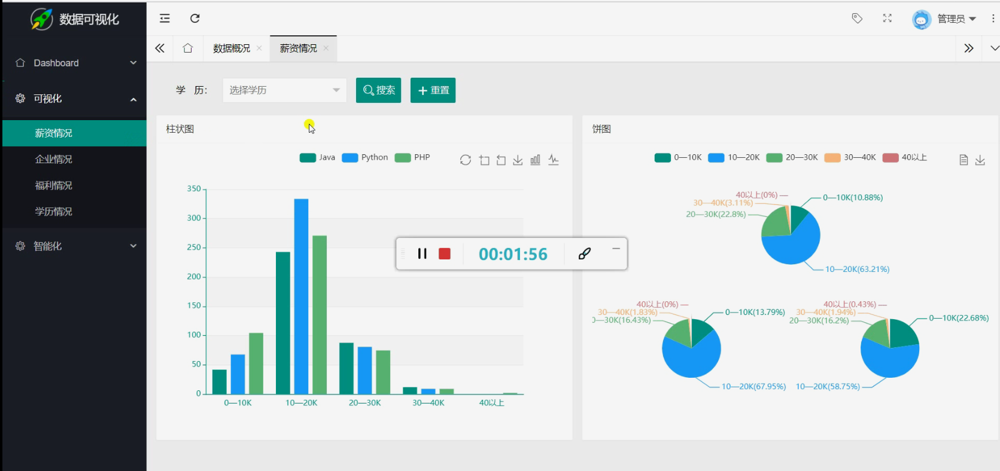
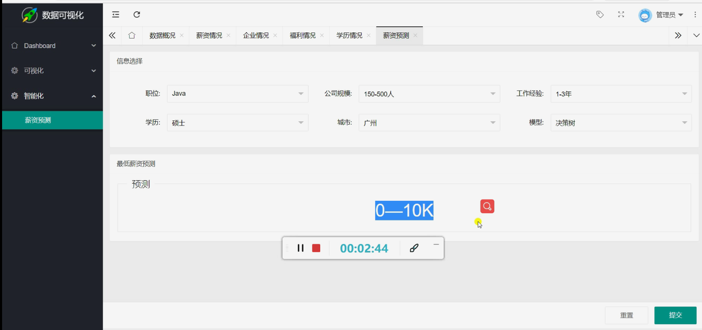

#Python招聘爬虫可视化系统(机器学习预测)

#要求
源码600一套不议价(论文 开题报告 PPT 文献综述 讲解视频 讲解笔记 源码+sql脚本)
白嫖滚蛋！源码收费的！别怨repo主爆粗口只是每天被一群白嫖杂种整神经了
加好友前帮忙start一下，并备注github有偿获取源码
我的QQ号是2877135669
加qq好友说明（被部分 s b 网友整得心力交瘁）：
    1.加好友务必按照格式备注
    2.避免浪费各自的时间，不议价！不议价！不议价！
    3.当“客服”不容易，repo 主是体面人，不爆粗，性格好，文明人。上面的 sb 字眼请谅解
    
#为啥这么娼？
全网只有我的招聘爬虫每年都会维护防止失效，你要觉得自己能github/gitee搜到免费能用
并且当前不失效的招聘爬虫我叫你一声爹！就这么自信！不行咱们试试！！    

#开发技术

本程序使用python编写，基于flask的轻量级web应用框架，数据库采用mysql设计，
百度echarts进行数据可视化显示。数据爬取使用经典的requests、urllib包进行数据爬取，
爬取的网站为拉勾网，拉勾网有较强的反爬机制，采用cookie的形式进行封装，
再进行数据获取。获取的数据解析后存储到mysql数据库，然后使用pymysql包连接mysql将查询的数据展示到页面。
  
#网页提供了如下功
    1.首页
2.数据概况：可以通过学历和职位来选择查看满足条件的招聘信息，可以选择学历要求、输入职位来搜索更加精准的职位。
3.可视化：
	薪资情况：通过选择学历来查看各种岗位对于不同学历的薪资可视化情况，以柱状图、饼图的形式来展示各种职位的薪资分布、所占比例。
	企业情况：通过选择职位可以来查看这个职位的主要招聘城市，还可以大概查看一下这个职位的公司规模情况，以及每个职位在各个主要城市所占的比例饼图。
	福利情况：通过数据可视化速览公司福利，基于词云进行构造，可以清晰看出所有公司给出的最核心的福利待遇。
	学历情况：可以查看各个职位对学历以及工作经验的要求，以漏斗图、矩形树的形式进行可视化展示。
4.智能化
	薪资预测：可以通过选择职位学历公司规模城市工作经验，以及选择不同的模型来，预测最低薪资。主要模型有：决策树、朴素贝叶斯、逻辑回归、神经网络、随机森林、支持向量机等。
	
	
#运行截图
	

#运行视频(B站)
https://www.bilibili.com/video/BV155411H7iL?spm_id_from=333.999.0.0

